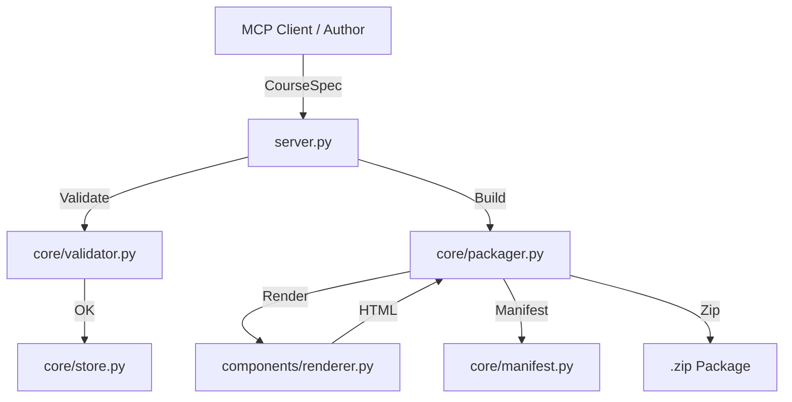

# Mimari (Architecture)

edumints-scorm-mcp, yapılandırılmış bir kurs spesifikasyonunu (spec) standartlara uygun, kendi kendine yeten bir SCORM paketine dönüştüren bir **assembler** (birleştirici) sunucusudur.

## Temel İlke: "Sunucu LLM Çağırmaz"

Bu projenin en temel mimari kuralı şudur: **Sunucu asla bir LLM (Large Language Model) çağrısı yapmaz.**

*   **Yazar (Author):** MCP istemcisidir (örneğin Claude, bir insan veya başka bir yapay zeka). Kursun içeriğini, yapısını ve mantığını istemci belirler.
*   **Birleştirici (Assembler):** Bu sunucudur. İstemciden gelen talimatları doğrular, bileşenleri birleştirir, HTML render eder ve paketler.

Herhangi bir LLM bağımlılığı sunucu tarafına eklenemez. Sunucu deterministik (belirli girdiye belirli çıktı) çalışmayı hedefler (medya üretimi gibi üretken süreçler hariç).

## İstek Akışı (Request Flow)

Bir kursun oluşturulma süreci tipik olarak şu adımlardan geçer:

1.  **Spec (Spesifikasyon):** İstemci, `build_from_spec` aracını kullanarak tüm kursu tek bir JSON objesi olarak gönderir veya `create_project`, `add_screen`, `add_asset` gibi araçlarla kursu parça parça inşa eder.
2.  **Validate (Doğrulama):** `core/validator.py` modülü, projenin bütünlüğünü kontrol eder.
    *   Tüm asset referanslarının geçerli olup olmadığını kontrol eder.
    *   Dallanma (branching) hedeflerinin varlığını doğrular.
    *   SCORM 1.2 için `suspend_data` sınırlarını tahmin eder.
    *   Üretilen `imsmanifest.xml` dosyasını XSD şemalarına göre doğrular.
3.  **Render (Görselleştirme):** `components/renderer.py`, proje modelini alır ve `components/templates.py` içerisindeki şablonları kullanarak nihai HTML dosyasını (`index.html`) oluşturur.
    *   **Preview Mode:** Tüm varlıkları (assets) data-URI olarak gömer, tek bir HTML dosyası üretir.
    *   **Package Mode:** Varlıklara ve çalışma zamanı (runtime) dosyalarına göreli yollarla referans verir.
4.  **Package (Paketleme):** `core/packager.py` süreci yönetir.
    *   Render edilen HTML, varlıklar ve `runtime/` altındaki SCORM çalışma zamanı dosyaları bir araya getirilir.
    *   `core/manifest.py` ile `imsmanifest.xml` oluşturulur.
    *   Tüm dosyalar deterministik bir yapıda ZIP'lenerek SCORM paketi haline getirilir.

## Modül Sorumlulukları

| Modül | Sorumluluk |
| :--- | :--- |
| `server.py` | FastMCP araç tanımları, HTTP rotaları ve dual-auth (API-key/OAuth) yönetimi. |
| `core/project.py` | Kanonik veri modelleri (Pydantic v2). Tüm veri yapısı burada tanımlanır. |
| `core/store.py` | SQLite tabanlı kalıcılık katmanı. Proje, asset ve paket meta verilerini saklar. |
| `core/validator.py` | Proje yapısı ve paket standartlarına uygunluk denetimi. |
| `core/packager.py` | Build işlerinin kuyruğa alınması ve ZIP paketinin oluşturulması. |
| `core/manifest.py` | SCORM 1.2 ve 2004 standartlarına uygun manifest üretimi. |
| `core/media.py` | ffmpeg kullanarak ses/video işleme ve normalizasyon. |
| `components/renderer.py` | Proje modelinden HTML üretim mantığı. |
| `components/templates.py` | HTML kabuğu (shell), temel CSS ve motor (engine) JS kodları. |
| `runtime/` | Üçüncü taraf SCORM çalışma zamanı kütüphaneleri (örn. `scorm-again`). |
| `auth/` | Güvenlik sınırları, SSRF koruması ve kota yönetimi. |

## Veri Akış Şeması

